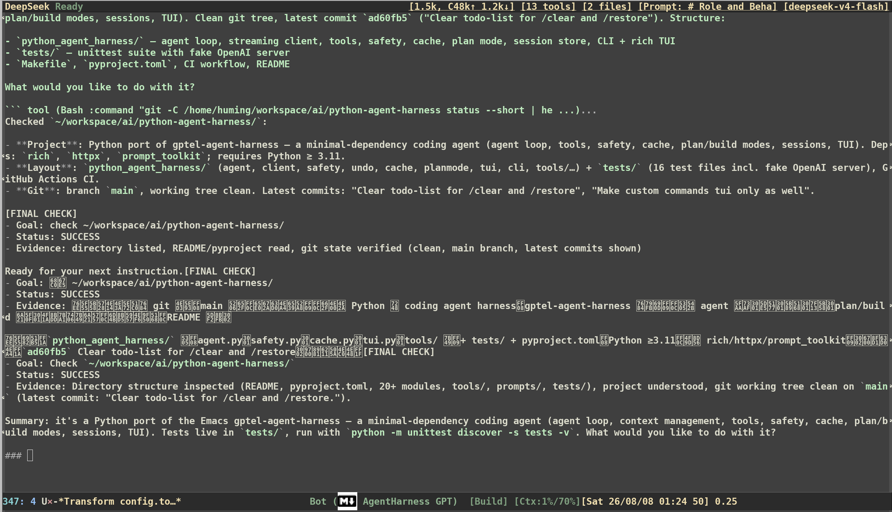

<div align="center">

# gptel-agent-harness

[](https://github.com/beacoder/gptel-agent-harness/actions/workflows/ci.yml)
[](https://melpa.org/#/gptel-agent-harness)

</div>

An execution harness for `gptel-agent` that adds reliable, autonomous coding-agent behavior.

It adds completion supervision, context management, session persistence, enhanced tools, Plan/Build modes, and OpenCode-like agent behavior — while keeping `gptel-agent` and upstream `gptel` intact.

For a standalone Python implementation of the same core ideas, see [`python-agent-harness`](https://github.com/beacoder/python-agent-harness).

## Demo



## Features

* **Completion supervision** — Nudges the agent to verify task completion instead of stopping prematurely.
* **Context management** — Tracks context usage, calibrates token estimates from API counts, and automatically compacts long conversations.
* **Session persistence** — Automatically saves sessions, generates titles, and restores previous sessions with a live preview.
* **Enhanced tools** — Git-aware `Glob` and `Grep`, interactive `Question`, and `PlanExit` tools.
* **Plan / Build modes** — Use a read-only planning phase before allowing code changes.
* **OpenCode agent** — Provides an OpenCode-like coding-agent experience through `gptel-opencode-agent`.
* **Sub-agent models** — Run delegated sub-agent work with a separate, cheaper model.
* **Commands** — Project initialization, code review, summaries, compaction, and custom commands.
* **FSM hardening** — Recovers from malformed tool calls and tool results that could otherwise leave `gptel`'s request state machine stuck.

## Quick Start

Enable the harness with `use-package`:

```elisp
(use-package gptel-agent-harness
  :ensure t
  :config
  ;; add project related information into llm context, e.g: coding guideline, etc.
  (require 'gptel-context)
  (gptel-add-file (expand-file-name "~/.emacs.d/contexts"))
  (add-to-list 'gptel-agent-skill-dirs "~/.emacs.d/skills")
  (gptel-agent-harness-mode 1)
  (gptel-agent-update)
  ;; Optional: use a cheaper model for sub-agents.
  (setq gptel-agent-harness-subagent-model "deepseek-v4-flash")
  (setq gptel-agent-harness-subagent-backend nil)
  ;; add more context window settings.
  (add-to-list 'gptel-agent-harness-context-windows '("openai/gpt-oss-120b" . 128000))
  (add-to-list 'gptel-agent-harness-context-windows '("Qwen/Qwen3.5-35B-A3B" . 262144)))
```

## Usage

### Coding Agent

```text
M-x gptel-opencode-agent
```

Starts an OpenCode-like autonomous coding-agent session.

### Plan / Build

```text
M-x gptel-agent-harness-toggle-mode
M-x gptel-agent-harness-set-mode
```

Each `gptel` buffer has a `build` or `plan` mode.

* **Build** — normal coding-agent execution.
* **Plan** — inspect the project and create a plan without modifying the codebase.

`PlanExit` allows the agent to request user approval before switching from plan to build mode.

### Commands

| Command                                       | Description                                           |
| --------------------------------------------- | ----------------------------------------------------- |
| `gptel-agent-harness-commands-initialize`     | Create/update `AGENTS.md`                             |
| `gptel-agent-harness-commands-review`         | Review uncommitted changes, commits, branches, or PRs |
| `gptel-agent-harness-commands-summary`        | Summarize a conversation                              |
| `gptel-agent-harness-commands-compact-buffer` | Manually compact the conversation                     |
| `gptel-agent-harness-restore-session`         | Restore a saved session                               |
| `gptel-agent-harness-restore-latest-session`  | Restore the latest session                            |

Custom commands can be added as Markdown prompts under `prompts/commands/`.

## Configuration

Most behavior is controlled through Emacs variables.

### Context

```elisp
(setq gptel-agent-harness-context-trigger 0.70)
```

Context usage is automatically monitored and compacted when it exceeds the configured threshold.

Model context windows can be extended with:

```elisp
(add-to-list 'gptel-agent-harness-context-windows
             '("openai/gpt-oss-120b" . 128000))
```

### Sessions

```elisp
(setq gptel-agent-harness-auto-save-session t)
(setq gptel-agent-harness-session-dir
      "~/.emacs.d/gptel-sessions/")
```

Sessions are automatically saved after LLM responses and can be restored interactively.

### Sub-agents

The main agent can use a different model for delegated work:

```elisp
(setq gptel-agent-harness-subagent-model "deepseek-v4-flash")
(setq gptel-agent-harness-subagent-backend nil)
```

Set the model/backend to `nil` to inherit the main agent configuration.

### Keybindings

Keybindings are optional:

```elisp
(global-set-key (kbd "C-c g a") #'gptel-opencode-agent)
(global-set-key (kbd "C-c g m") #'gptel-agent-harness-toggle-mode)
(global-set-key (kbd "C-c g r") #'gptel-agent-harness-commands-review)
(global-set-key (kbd "C-c g i") #'gptel-agent-harness-commands-initialize)
(global-set-key (kbd "C-c g u") #'gptel-agent-harness-commands-summary)
(global-set-key (kbd "C-c g c") #'gptel-agent-harness-commands-compact-buffer)
(global-set-key (kbd "C-c g s") #'gptel-agent-harness-restore-session)
```

## Project Layout

```text
├── gptel-agent-harness.el           # Entry point: minor mode + module wiring
├── gptel-agent-harness-config.el    # User options and prompt files
├── gptel-agent-harness-compact.el   # Automatic context compaction
├── gptel-agent-harness-display.el   # Mode-line display, token calibration, context rules
├── gptel-agent-harness-supervisor.el # FSM supervisor, build/plan mode
├── gptel-agent-harness-fsm.el       # FSM hardening, internal state, token estimation
├── gptel-agent-harness-session.el   # Session persistence and restore
├── gptel-agent-harness-tools.el     # Enhanced tools
├── gptel-agent-harness-agent.el     # OpenCode-like agent
├── gptel-agent-harness-commands.el  # Built-in and custom commands
├── prompts/                          # Prompt templates
│   └── commands/                     # Custom command prompts
├── agents/                           # Agent definitions
└── tests/                            # ERT test suite
```

## Requirements

* Emacs ≥ 29.1
* `gptel-agent` ≥ 0.0.1
* `compat` ≥ 30.1.0.0
* Optional: `git`, `tree`, `ripgrep`

## Related projects

- [python-agent-harness](https://github.com/beacoder/python-agent-harness) — the Python implementation that inspired by this project.
- [opencode](https://github.com/anomalyco/opencode) — the primary source of many prompts and coding-agent behaviors.

## License

GPL-3.0-or-later
